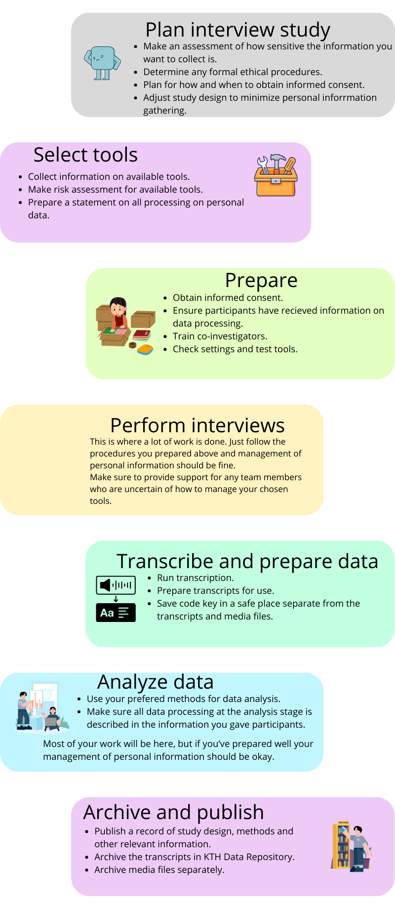

# God praxis för hantering av forskningsdata vid intervjustudier

## God forskningssed vid planering, genomförande, inspelning och transkribering av intervjuer

Intervjuer är en vanlig kvalitativ forskningsmetodik som kan utföras i olika sammanhang,
till exempel online, som fältstudier, eller under mycket kontrollerade kliniska miljöer
som beskrivs i ett etiskt tillstånd. När du genomför en intervjustudie kommer huvuddelen
av ditt arbete att vara själva intervjuerna och att analysera resultaten.
I de fall där du främst är intresserad av *vad* som sägs och inte *hur* det sägs,
är **transkribering** vanligt förekommande.

Syftet med den här guiden är att belysa vad du ska tänka på när du vill spela in
och transkribera intervjuer digitalt. Genom att delta i din studie anförtror dina 
forskningsdeltagare sin personliga information. Ditt mål kommer att vara att behandla
informationen noggrant, att minimera riskerna och att maximera nyttan av den tid och
ansträngning som du och dina deltagare spenderar.

Genom att redan i planeringssteget överväga hur personuppgifter kommer att behandlas
i din forskning kan du både underlätta ditt eget arbete och förbättra kommunikationen
med olika intressenter.

## Checklista: överväganden från planering till publicering

Denna checklista försöker ta hänsyn till många olika scenarier, så hoppa gärna
över objekt som inte är relevanta för din forskning.

### Planering

+ **Bedöm hur känslig informationen du vill samla in är** - Planerar du att samla in
  information som kan orsaka skada för individer som deltar i forskningsstudien?
  Bedöm vilken typ av risk som kan uppstå och se till att alla inblandade är
  medvetna om riskerna.
+ **Bestäm eventuella formella etiska förfaranden** - Om din forskning omfattar
  särskilda kategorier av personuppgifter eller information om enskilda personers
  brottsregister måste du ansöka om etikprövning från Etikprövningsmyndigheten.
  [KTH Research Support Office har mer information på sin webbplats](https://intra.kth.se/forskning/overgripande-stod/etik-och-god-forskni/forskningsetik-stod-till-forskare-1.1031754).
  Svenska forskningsfinansiärer förlitar sig vanligtvis på det nationella
  etikprövningssystemet. Men för internationella finansiärer, kontrollera deras
  regler och krav. Om din forskning inte behöver etikprövning från
  Etikprövningsmyndigheten, men din finansiär ändå kräver att du har ett godkännande
  från en institutionell etikkommitté, kontakta [KTH:s etikutskott](https://www.kth.se/om/organisation/2.32498/etikutskottet-1.1104520).
+ **Planera för hur och när du ska få informerat samtycke** - Vill du få informerat
  samtycke i skriftlig form eller räcker det att spela in det i början av intervjun?
[//]: # (TO-DO could we link to those templates?)
  Det finns mallar för informerat samtycke.
+ **Justera studiedesignen för att minimera insamlad personlig information** - Överväg
  om du kan formulera intervjuguider eller intervjufrågor för att uppmuntra svar
  som är användbara för din forskning utan att samla in känslig information mer än
  nödvändigt. Om du vill citera svar som innehåller personuppgifter måste du ta bort
  information som skulle göra det möjligt att avidentifiera individer om de inte har
  gett uttryckligt samtycke till att nämnas i publicerat material.

### Välj verktyg för inspelning, transkribering och bearbetning

+ **Samla in information om tillgängliga verktyg** - Se
[//]: # (TO-DO we need to link here)
  instruktionsguiden på sidan för KTH:s IT-verktyg.
+ **Gör en riskbedömning för de tillgängliga verktygen** - Se
[//]: # (TO-DO we need to link here)
  guiden på sidan för beskrivning av risker för av KTH-IT tillhandahållna verktyg.
+ **Förbered ett utlåtande om behandling av personuppgifter** - Detta kan vara
  så enkelt som en lista över de verktyg du använt i forskningsstudien.

### Förbered dig för intervjuer

+ **Erhåll informerat samtycke** - Deta är viktigt om din forskning bedrivs under
  ett etikprövningstillstånd.
+ **Tillse att deltagarna har fått information om databehandling** - Se till att
[//]: # (TO-DO kanske ge ett par exempel här på *hur* detta åstadkommes)
  deltagarna i din forskningsstudie är medvetna om hur deras personuppgifter behandlas.
+ **Utbilda dina kollegor** - Om ni är mer än en person som utför forskningen
  bör du tillse att dina kollegor har fått de kunskaper de behöver.
+ **Kontrollera inställningar och testa verktyg** - Se
[//]: # (TO-DO this link goes to a Confluence page, it too needs to be added to the Workspace)
[//]: # (https://confluence.sys.kth.se/confluence/spaces/FOR/pages/299896981/How+to+record+and+transcribe+interviews)
  de praktiska guiderna om hur du spelar in intervjuer.

### Utför intervjuer

+ **Följ de procedurer du förberett ovan** - Förberedelserna säkerställer korrekt
  hantering av personlig information så att du kan fokusera på själva intervjun.
+ **Stöd dina teammedlemmar så att de känner till proceduren** - Genom att stödja
  teammedlemmar som är osäkra på hur de hanterar dina valda verktyg kommer
  intervjuer och transkribering att gå bättre.

### Transkribera och behandla data

+ **Utför transkribering** - Se
[//]: # (TO-DO same link as above, to Confluence page, its content should be added to Workspace)
[//]: # (https://confluence.sys.kth.se/confluence/spaces/FOR/pages/299896981/How+to+record+and+transcribe+interviews)
  de praktiska guiderna för hur man gör det.
+ **Förbered utskrifter för användning**.
+ **Spara kodnyckeln på ett säkert ställe som är åtskilt från utskrifterna och mediefilerna**.

### Analysera

[//]: # (TO-DO the following item (3 lines) is poorly written!)
+ **Använd dina valda metoder för dataanalys** - För närvarande finns det ingen
  centralt upphandlad tjänst på KTH men du kan kontakta din skolas IT-koordinator
  för information om licenser.
+ **Tillse att all databehandling i analysskedet beskrivs i den information du gav deltagarna**.

### Publicera och arkivera

**Publicera en eller flera poster med material som beskriver studiens utformning,
metoder och annan relevant information**. Filer med utskrifter laddas upp för arkivering,
i de flesta fall lämpligen med begränsad åtkomst till filer. Mediafiler rekommenderas
att laddas upp med begränsad åtkomst i de flesta fall. Hänvisa gärna till postens
DOI i artikelns "Data availability statement" när resultaten publiceras.

+ **Arkivera utskrifterna i [KTH Data Repository](https://datarepository.kth.se)** - se
  till att välja en lämplig åtkomstnivå för utskriftsfilerna enligt forskningsdeltagarnas
  samtycke och att behandla utskrifter i syfte att dölja känslig information som
  inte behövs för din forskningsstudie.
+ **Arkivera mediefiler separat** - Om inspelningarna inte innehåller känsliga
  personuppgifter kan du arkivera dem som en separat post i
  [KTH Data Repository](https://datarepository.kth.se).
  Alternativt kan du lägga till samtyckesformulär till posten. Rekommenderad praxis
  är att länka till den publicerade posten och till posten med mediefilerna,
  förutsatt att medieposten inte omfattas av strikt sekretess. Om mediefilerna innehåller
  material som omfattas av strikt sekretess, kontakta <security@kth.se> för råd om
  säkra arkiveringslösningar.
+ **Förvara kodnyckeln säkert i ett separat utrymme** - Om du inte har tillgång
  till en säker digital förvaringsplats på din institution, kontakta <security@kth.se>
  för råd.

## Allmänna risker relaterade till personlig integritet för personer som deltar i en digitalt utförd intervjustudie

Intervjuer dokumenteras ofta i form av video- eller ljudinspelningar, och dessa
inspelningar måste hanteras med försiktighet eftersom de innehåller biometriska uppgifter:
röster i ljud- eller videoinspelningar respektive ansikten i videoinspelningar.
Detta innebär att sådana inspelningar inte kan publiceras öppet om inte deltagaren
ger sitt uttryckliga samtycke.

Det innebär också att du måste överväga etiska aspekter och bedöma risken utifall
att information som samlats in under intervjuerna läcker. Om risken är stor att
enskilda personer kan skadas om deras personuppgifter läcker ut, måste du vidta
rimliga säkerhetsåtgärder för att säkerställa behandling av sådana känsliga
personuppgifter på ett sätt som minskar risken för dataläckor.
Det är också bra att dokumentera denna riskbedömning - det vill säga vilka risker
du ser och vilka digitala verktyg du har använt och vilka säkerhetsåtgärder du har
vidtagit. Detta kan göras som en del av en datahanteringsplan eller i ett separat dokument.

### Rekommenderade säkerhetsåtgärder för att förhindra dataläckor om du samlar in känsliga personuppgifter

Känsliga personuppgifter är enligt GDPR personuppgifter om hälsa, sexuell läggning,
politisk åskådning, etnicitet, medlemskap i fackförening eller genetisk och biometrisk information.
Personuppgifter kan också vara känsliga om de samlas in från någon som tillhö
en utsatt grupp, till exempel barn eller politiska flyktingar.

+ [Läs mer om känsliga personuppgifter hos Integritetsskyddsmyndigheten](https://www.imy.se/verksamhet/dataskydd/det-har-galler-enligt-gdpr/introduktion-till-gdpr/personuppgifter/kansliga-personuppgifter)

En viktig punkt här är att om risken för att orsaka skada för individer är hög
om data hamnar i fel händer, måste du vidta extra säkerhetsåtgärder för att skydda
informationens konfidentialitet:

+ Spela in intervjuer med hjälp av antingen en KTH-upphandlad inspelningstjänst
  eller en separat inspelningsenhet.
+ Minimera åtkomst till filerna genom att inte dela åtkomst till fler forskare än
  nödvändigt och använd ett starkt lösenord och om möjligt tvåfaktorsautentisering
  för åtkomst.
+ Spara inte filer i en tjänst som du använder tillfälligt för behandling längre än
  nödvändigt. Det vill säga, om du använder en tjänst för videoinspelning och
  överför filerna till en säker lagringsplats, bör du ta bort filerna från
  inspelningstjänsten när du har överfört dem.
+ Använd krypterad överföring för att flytta filer till en åtkomstkontrollerad,
  krypterad lagringsplats.
+ Minimera eller undvik användning av digitala tjänster med mycket långa kedjor av
  underentreprenörer, särskilt om sådana underentreprenörer kräver överföring av
  personuppgifter utanför Europa. Transkribering med automatisk realtidstextning
  rekommenderas därför **inte** för sekretesskänsliga intervjuer.
+ Behandla utskrifterna för att ta bort personlig information - se
  mer om metoder i den [nationella vägledningen om behandling av kvalitativa uppgifter](https://researchdata.se/sv/hantera-data/data-med-personuppgifter/handbok-data-med-personuppgifter/metoder/metoder-kvalitativa).
+ Använd ett forskningsdataregister som uppfyller arkivkraven och som upprätthåller
  långsiktig lagring (minst tio år) av inspelningar och utskrifter.
  Förvara inspelningar och kodnycklar i ett separat lagringssystem/mapp/register med
  striktare åtkomstkontroll än utskrifterna. En metadatapost som beskriver studien
  och innehåller kontaktuppgifter för begäran om åtkomst kan deponeras i ett
  dataregister med åtkomstkontroll, till exempel
  [researchdata.se](http://researchdata.se) eller
  [KTH Data Repository](https://datarepository.kth.se).

Beroende på din forskningskontext finns det många arbetsflöden för inspelning och
transkribering av intervjuer, som består av olika digitala tjänster, system eller
programvara installerade på din egen enhet. Som vi har sett har olika verktyg och
tillvägagångssätt olika för- och nackdelar.

[//]: # (TO-DO same link as above, to Confluence page, its content should be added to Workspace)
[//]: # (https://confluence.sys.kth.se/confluence/spaces/FOR/pages/299896981/How+to+record+and+transcribe+interviews)
För praktiska handledningar om hur du kan utföra ett sådant arbetsflöde - titta
på handledningarna för hur du använder KTH:s digitala verktyg för inspelning och transkribering.
